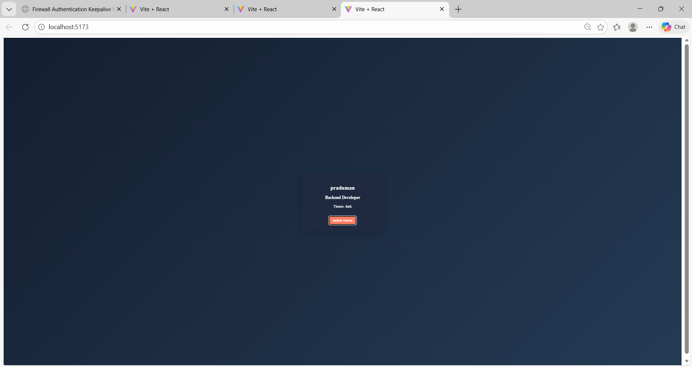

# 🚀 Exp-4: Redux Counter Application

This repository contains a React application demonstrating the implementation of **Redux** for state management.

---

## 📂 Project Structure

exp-4/
│
├── src/
├── screenshots/
└── README.md

---

## 🛠️ Technologies Used

- React
- Redux
- React-Redux
- JavaScript
- CSS

---

# 📌 Project Description

This project demonstrates:

- Creating a Redux store
- Defining actions
- Implementing reducers
- Connecting Redux with React components
- Managing global state using Redux

The application includes a simple **Counter** with:

- Increment
- Decrement
- Reset

---

# 📸 Output Screenshots

## 🏠 Initial Page


---

## ➕ Counter Increment


---

## ➖ Counter Decrement


---

## 🔄 Counter Reset


---

## 📷 Additional View


---

# ⚙️ How to Run the Project

```bash
npm install
npm start
